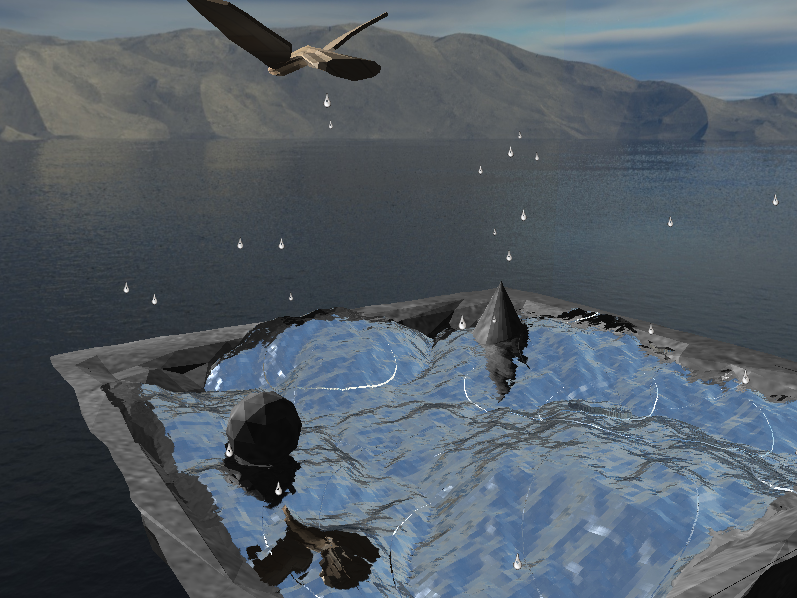

# Water Rendering

## How to run the code

- Enviroment: Ubuntu 22.04

1. `git clone https://github.com/fmb123456/Water-Rendering.git`
2. `cd Water-Rendering`
3. `git submodule update --init --recursive`
4. `mkdir external/glfw/build && cd external/glfw/build`
5. `cmake .. -DBUILD_SHARED_LIBS=OFF -DGLFW_BUILD_EXAMPLES=OFF -DGLFW_BUILD_TESTS=OFF -DGLFW_USE_XKB_COMMON=OFF -DGLFW_BUILD_DOCS=OFF`
6. `cd src && make`
7. `cd ../../../../ && make`
8. `./water_rendering` should work.
